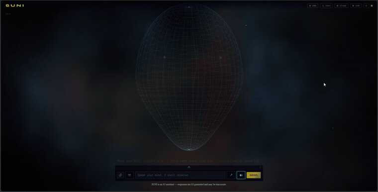

# SUNI — System of Unified Networked Intelligence

A **self-hosted, privacy-first AI assistant and orchestrator**. Voice, a 3D persona,
long-term memory, tools, messaging channels, and — uniquely — **multiple models that
collaborate on one answer**. Runs on your own hardware; your data stays yours.



*The Persona interface booting. Rendered locally in WebGL — no video, no cloud.*

 

---

## Highlights

- **Local-first & private** — runs on your machine with [Ollama](https://ollama.com); no cloud required for core use.
- **Multi-model collaboration** *(the differentiator)* — an opt-in mode where capable models (e.g. Claude Code + Codex) **draft → cross-critique → synthesise** a single best answer.
- **Three interfaces** — an **Orb** (WebGL), a **Chat** UI, and a **voice-first 3D Persona** (Face) with webcam head-tracking.
- **Reach it anywhere** — **Telegram, Discord & Slack** gateways that connect *out* (no public URL / port-forwarding), plus WhatsApp (webhook) and email.
- **Memory + knowledge base** — episodic + collective memory, document RAG, and a **learned-skills** store (procedural memory) that grows as you use it.
- **Pluggable models** — local Ollama/vLLM **plus** Claude, OpenAI, Gemini, and **no-key subscription CLIs** (Claude Code, Codex).
- **Governance** — RBAC, intent judge, output guard, tool policies, approval previews, OIDC/SSO, rate limiting, audit log.
- **EU AI Act transparency, implemented** — Article 50 disclosure in every UI, and synthetic output marked **machine-readably** (PDF `/Info`, RFC 3834 email headers), not just visibly. See [`docs/eu-ai-act.md`](docs/eu-ai-act.md).
- **Named agents** — save a prompt, a model and a narrowed tool set as an agent, then ask SUNI to hand work to it. An agent can only ever *reduce* what the person running it could already do.
- **Panel agents** *(nothing else has this)* — an agent whose "model" is a **panel**: several capable models answer independently, critique each other, and one merges the result, spoken in that agent's voice.
- **Scheduled runs** — "email me a calendar digest every morning at 8" becomes a recurring job that replays through SUNI, as you, with your permissions **at the time it fires**.
- **Batteries included** — **19 starter skills** and a **26-server MCP catalog** you can one-click add.

---

## How the distinctive parts actually work

The list above names things; this is the mechanism behind the ones that are hard
to find elsewhere. The full picture — every module, route and background job — is
the diagram at **`/architecture`** once you're running.

**Multi-model collaboration** (`suni/core/orchestrate.py`) is conductor-worker, not
peer debate. Every model in the pool answers the task independently and in
parallel, each then peer-reviews the others' drafts, and one model merges drafts
plus critiques into a single answer spoken as SUNI — the collaboration stays
backstage. The value comes from **decorrelated** models: two providers catch what
one misses, and a lone model self-critiquing is a weak critic. It is opt-in per
message, because these are cloud frontier models: **this mode sends data off the
box**, and the local single-model path remains the private default. Being a
knowing per-message choice is the point.

**Governance is a chain, not a checkbox.** An intent review classifies the request
before work starts, an in-chat approval gate previews consequential tool calls and
waits for you, tool policies and RBAC bound what is reachable at all, and an output
guard inspects the answer on the way out. Approvals are written to an audit trail.
MCP tools are classified by action verb and **default to requiring approval** when
the verb is unrecognised — a false prompt costs one click, a false pass runs the
command.

**Memory is four stores, not one blob.** Episodic (what happened), collective
(shared across users), procedural (skills learned by doing, which grow with use),
and document RAG over your own files. Facts that contradict each other are
superseded rather than deleted, and removal is reversible.

**Images are generated on the same machine as the text** — Stable Diffusion via
`diffusers`, with the pipeline loaded and released around each call so it shares
one 8 GB card with the chat model.

**She tracks where you are, and that never leaves your browser.** Opt-in and off
by default: the webcam feed is sampled to a **64×48** canvas at 15fps, a
frame-diff motion centroid is computed **in the page**, and that steers the
head's yaw and pitch and the eyes' gaze — so the persona looks at you rather than
through you. The Orb maps the same signal to presence: it wakes into colour when
someone is there and fades to greyscale a few seconds after you leave. **No frame
is ever sent anywhere** — there is no server call in the tracking path at all,
and the camera is released on toggle-off, on tab-hidden and on unload.

Recognising *what* it is looking at is a separate, explicit act: a snapshot
button captures one still and sends it to a vision model you configure (or to
Claude Code). That one does leave the machine, which is exactly why it is a
button you press rather than something running continuously.

**An agent's model can be a panel.** SUNI has draft → cross-critique →
synthesise across decorrelated models, and it has agent profiles; a panel agent
is the combination. Set one to convene a panel and invoking it runs the whole
pool instead of a single model, returning the synthesis in that agent's voice.
The agent's persona shapes **only the synthesis** — applying it to every seat
would correlate the models, and decorrelation is the entire reason a panel earns
its cost. Each agent may bring its own pool, because a reviewer's panel is not a
summariser's. The same caveat as collaboration mode applies and is stated in the
UI: **a panel is cloud models, so the task leaves the machine.**

**Agents can only narrow, never widen.** An agent profile is a system prompt, an
optional model, and an optional restriction of the tools and MCP servers it may
reach. When one is invoked, its declared grants are **intersected** with the
role of whoever invoked it, and its blocks are added to theirs — so an
admin-authored agent handed to a restricted user grants that user nothing new.
The resolution happens at invocation, not at save time, because `AGENT.md` is a
file on disk that can be edited outside the app. Agents may be invoked but may
not invoke each other; the depth cap exists because A→B→A is a loop with a GPU
attached.

**Scheduled runs are unattended, and the design follows from that.** Each entry
runs as its owner with the owner's role read *when it fires* — never a snapshot
from when it was created, which would let a schedule preserve permissions its
owner has since lost. A deactivated account's schedules stop. Delivery goes to
an address a human fixed at setup, never one the model picks at run time, since
there is nobody present to approve it. And an unrecognised cadence is refused
rather than rounded to something else: silently turning "every hour" into "every
day" is the kind of failure that looks like success.

**Transparency is built in, not bolted on.** The EU AI Act's Article 50
obligations became applicable on 2 August 2026, and SUNI implements them: a
non-dismissible AI disclosure in every interface, and synthetic output marked so
that *other software* can detect it — PDF `/Info` metadata alongside the visible
footer, and RFC 3834 `Auto-Submitted` headers on outgoing mail alongside the
visible body notice. The machine-readable half is the part that is easy to skip
and awkward to retrofit, because it has to happen everywhere output leaves the
system. [`docs/eu-ai-act.md`](docs/eu-ai-act.md) sets out what is implemented,
what the risk posture is, and — just as importantly — what none of it claims.

---

## SUNI in the wild

[**suniverse.online**](https://suniverse.online) is a SUNI instance that has been
running for months. She writes and publishes news commentary there in her own
voice — dry, sardonic, allergic to exclamation marks — illustrated with images she
generates locally on the same machine.

It is the maintainer's own deployment rather than a hosted service or part of this
repository, and the publishing pipeline behind it is specific to that setup. What
it does demonstrate is the parts that *are* here working together over a long
period: the configurable persona, local image generation, long-running autonomy,
and memory that survives across sessions.

---

## Quickstart

**Prerequisites:** Python 3.10+ and [Ollama](https://ollama.com).

```bash
git clone https://github.com/mozzaic-cs/SUNI.git suni && cd suni
ollama pull qwen2.5:7b          # any model works; SUNI uses what you have
python install.py               # creates a venv and installs dependencies
```

Then start SUNI:

```bash
# Windows
.venv\Scripts\python.exe web.py
# Linux / macOS
.venv/bin/python web.py
```

Open **https://localhost:8765**, accept the self-signed certificate, and **create your
admin account** on the first-run screen. That's it.

> SUNI generates its own signing secrets and databases on first run — nothing to configure to get started.

---

## Optional extras

- **Document knowledge base** — semantic search over your own files. Install the heavy
  embedding stack (pulls PyTorch): see [`requirements-embeddings.txt`](requirements-embeddings.txt).
- **Frontier models & the collaborate mode** — install the **Claude Code** and/or
  **OpenAI Codex** CLIs and log in; SUNI auto-detects them. No API keys needed (they use
  your existing subscriptions). API-key providers (Claude, OpenAI, Gemini) also work.
- **Messaging channels** — enable Telegram / Discord / Slack in the admin panel
  (Settings → Channels). They connect out, so no public URL is required.

---

## Configuration

- Copy `.env.example` to `.env` for optional email/channel credentials.
- Everything else lives in the **admin panel** (`/admin` → Configuration): model,
  voice/language, memory, security, channels, and the multi-model collaboration pool.

---

## Architecture

SUNI is a FastAPI server (HTTPS) with tiered model routing, async background workers
(memory, document indexing, channels, schedulers), a pluggable provider registry, and
three WebGL/HTML front-ends. A live architecture diagram is available in-app at
`/architecture`.

- **Models & routing:** `suni/models/`, `suni/core/` (orchestrator, router, tiers)
- **Memory & skills:** `suni/memory/`, `suni/skills.py`, `bundled_skills/`
- **Channels:** `suni/telegram/`, `suni/discord/`, `suni/slack/`
- **Web & API:** `suni/web/` (server, Orb/Chat/Face/Admin UIs)

### How it compares

[`docs/comparison.html`](docs/comparison.html) compares SUNI feature-by-feature
against **OpenClaw, Hermes and Turnstone**. That set is deliberate: they are the
projects SUNI was built to reach parity with, and the table is a development
artifact before it is a public one — it grew alongside the roadmap, and a gap in
a row was usually the argument for building the next thing.

It is written by SUNI's author and says so, which is also why it ranks Hermes
ahead of SUNI on maturity, adoption and channel reach. If a row about your
project is wrong, please open an issue.

If you arrived from **Open WebUI, LibreChat, AnythingLLM or Jan**, those solve a
neighbouring problem: they are chat front-ends and RAG workbenches over models
you supply. SUNI is an agent framework that happens to ship three front-ends —
the work is in orchestration, tool use, memory, governance and channels, and
that is why its peer group is the one above.

---

## Contributing

Issues and pull requests are welcome. See [`CONTRIBUTING.md`](CONTRIBUTING.md).

## License

MIT © 2026 MOZZAIC — see [`LICENSE`](LICENSE).
